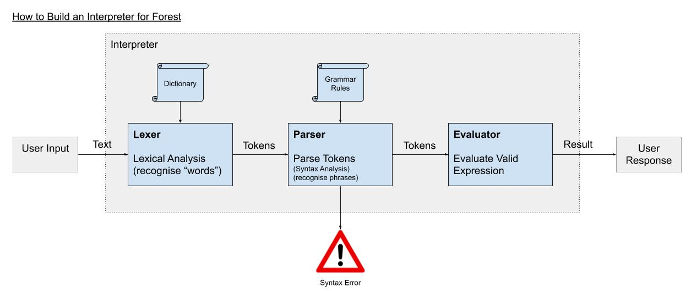

# 🌲 Forest language 🌲

A Python-based, forest-themed programming language. Coming soon!

# 🐻 [](https://travis-ci.org/lucianmot/f.rest)

## Team:
 [Aleks](https://github.com/ajmpawlik)    
 [Anna](https://github.com/aniasobo)  
 [James](https://github.com/zepherine2006DEV)      
 [Joe](https://github.com/josephtownshend)   
 [Lucian](https://github.com/lucianmot)

---
## How to Install Forest

* Ensure you have Python v3.7.4 installed.
* Clone or download this repository.

### Run Forest as a shell script

`$ python3 forest.py` will open a little Forest REPL. You should see a `=❱❯❭>` tree in your command line prompt. 


Try putting your own message between the `<<tree tops>>`!  

## Test and Code Coverage (via Script)

Install code coverage tool:

```console
$ pip3 install coverage
```

We've included a script to run all tests and code coverage (recommended):

```console
$ bash test_script
```

Read the output on the console, and open the htmlcov/index.html file to view details of coverage.

### How to Test (Manually)

run the command below specifiying the test file to be included.

```console
$ python3 -m unittest interpreter_test.py
```

### How to Check Code Coverage (Maually)

Run the code coverage report:

```console
$ coverage interpreter_test.py
$ coverage html
```
---
## Using Forest

### At the moment, Forest has the following capabilities:
* echo any text within `<<shovels>>` with `echo<<this message>>`
* create variables `BACKPACK:myvar^PACK_WITH^<<some text>>`
* TODO: use the owl operators for comparison expressions: `true^OvO^false` should return `Forest says: false`; `true^XvX^false` should return `Forest says: true`    
* TODO: use the crow operator to calculate modulus of integers: `9^(*)>^2` should return `Forest says: 1`  
* TODO: if statement: start your if statement with `WALK_PATH_IF_SEE` and end with `CAMP`  
* use `^` trees between operators and expressions (as you would with spaces in most programming languages) to avoid errors  
* but if you do end up with errors, we've added lots of unhelpful but entertaining bears to the error messages 🐻

### Reference

| Forest | Forest explicit | Human |   
| --- | --- | --- |   
| <<>> | shovels | string delimiters |  
| ^ | tree operator | space/general delimiter |  
| OvO | Owl operator | == equals/comparison |  
| XvX | Dead owl operator | != not equal |    
| (*)> | Crow operator | % modulo |   
| ^._.^ | Bat operator | (sadly unused but LOOK HOW COOL IT IS! TODO for version 2.0) |      
| WALK_PATH_IF_SEE | do this if | if statement start |  
| BACKPACK: | create backpack | variable instantiation |   
| PACK_WITH | store in backpack | = variable assignment |  
| CAMP | end statement | end of expression |  
| true/false | acceptable booleans |  


## Design

The diagram below shows how our interpreter is built:




Take care, don't start the fire.
